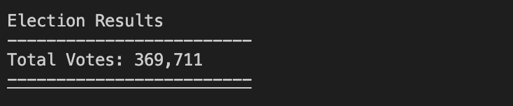
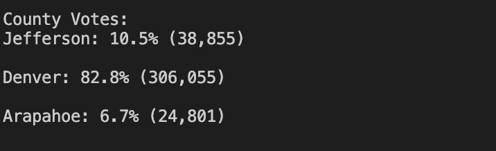
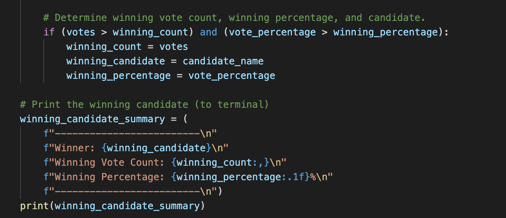
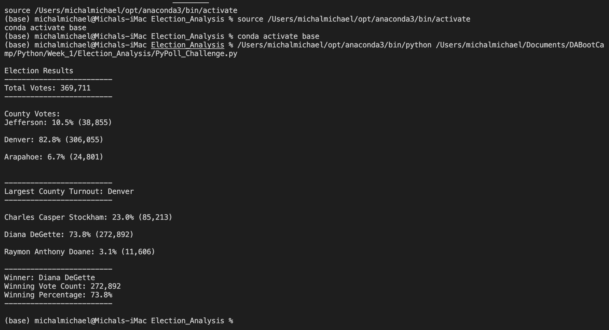

# Election_Analysis

## Project Overview
A Colorado Board of Elections employee has given you the following tasks to complete the election audit of a recent local congresional election.

1. Calculate the total number of votes cast.
2. Get a complete list of candidates who received votes.
3. Calculate the total number of votes each candidate received.
4. Caulculate the percentage of votes each candidate won.
5. Determine the winner of the election based on popular vote.

## Resources
- Data Source: election_results.csv
- Software: Python, VS Code

## Summary
The analysis of the election show that:
- There were 739,422 votes cast in the election:
- The candidates were:
    - Charles Casper Stockham
    - Diana DeGette
    - Raymon Anthony Doane
- The candidate results were:
    - Charles Casper Stockham received 23.0% of the vote and 170,426 votes.
    - Diana DeGette received 73.8% of the vote and 545,784 votes.
    - Raymon Anthony Doane received 3.1% of the vote and 23,212 votes.
- The winnder of the election was:
    - Diana DeGette, who received 73.8% of the vote and 545,784 votes!

## Challenge Overview - Overview of Election Audit
In order to complete the election audit, the election commission would like more data to increase their knowledge of voter turnout. In this challenge, we focused on the county voter profiles. We worked on documenting the voter turnout within each county, the percentage of votes per county as a portion of the total votes, and pinpointed the county with the highest voter turnout. 

## Challenge Summary
### Election-Audit Results
-  There were 369,711 votes cast in the congressional election.

- Below is a breakdown of the number of votes and the percentage of total votes for each county in the precinct.

- Denver had the largest number of votes with 306,055 votes. In the below screenshot, you can see the output of the calculation to find the largest county.

- Below is a breakdown of the number of votes and the percentage of the total votes each candidate received.

- Diana DeGette won the election with a winning vote count of 272,892 and a total voter percentage of 73.8%. In the below screenshot of code you can see that once the votes are pulled for each candidate, the number of votes is compared the the number of votes in for the "winning candidate" (and the same for percentage). The first candidate to be tested will automaticall be the "winning candidate" becuase the winnig candidate vote variable is set to 0 at the start. But, only once all of the candidates are compared to the winning candidate vote variable can the final and true winning candidate be printed.

As a summary to the above information, I included a screenshot of my output in the terminal.

### Election-Audit Summary
In a summary statement, provide a business proposal to the election commission on how this script can be used—with some modifications—for any election. Give at least two examples of how this script can be modified to be used for other elections.

In addition to this script being useful for this specific election, it can be used in future elections as well. In order to enable use in other elections, the main change that would need to be made is changing the variable "file_to_load = os.path.join("Resources", "election_results.csv")" would need to be modified to include the correct file path. But, other than that change, the file would run as expected. 
Two modifications that could improve the data from the collected file are:
1. Adding to the script to find out what percentages of each county voted for each candidate. This would allow more visibility into the voter preferences within a given area.
2. If a file with more data is read in, the script could incldue a summary of the times of day that candidates vote. This would help polling stations to be fully staffed and stay open for the mosst popular hours. 

